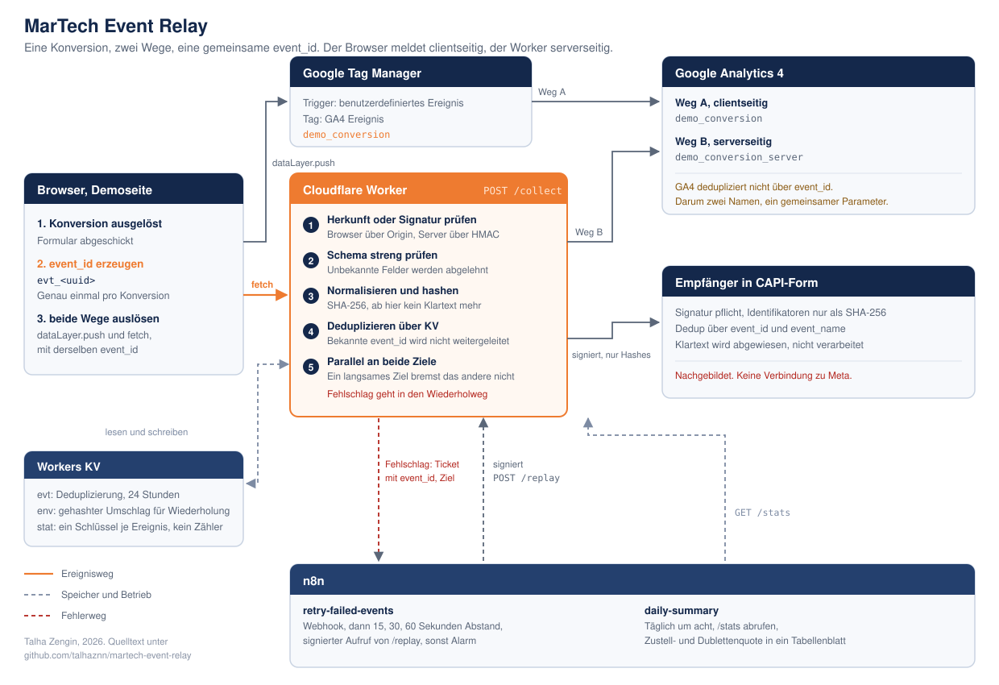

# MarTech Event Relay

Eine Konversion, zwei Wege, eine gemeinsame `event_id`. Der Browser meldet clientseitig über den
Google Tag Manager an GA4. Parallel geht dieselbe Konversion an einen Cloudflare Worker, der sie
serverseitig an das Measurement Protocol und an einen Empfänger in der Form der Meta Conversions API
weiterreicht. Fehlgeschlagene Zustellungen laufen über n8n mit wachsendem Abstand nach.



---

## Warum es dieses Projekt gibt

Ich baue Automationen, APIs und interne Werkzeuge. Tracking im engeren Sinn,
also Google Tag Manager, GA4, Measurement Protocol und n8n, hatte ich beruflich bis dahin nicht in
der Hand.

Das lässt sich auf zwei Arten in eine Bewerbung schreiben. Man kann behaupten, dass man schnell
lernt. Oder man baut es und legt den Quelltext daneben. Dieses Repository ist die zweite Variante.

Es ist bewusst klein gehalten und trotzdem vollständig: es läuft, es hat Tests, es hat ein Kapitel
über seine eigenen Grenzen, und jede Entscheidung darin ist begründet statt abgeschrieben.

---

## Inhalt

- [In fünf Minuten selbst ausprobieren](#in-fünf-minuten-selbst-ausprobieren)
- [Was das Ding tut](#was-das-ding-tut)
- [Vollständige Einrichtung](#vollständige-einrichtung)
- [Schnittstelle](#schnittstelle)
- [Warum es so gebaut ist](#warum-es-so-gebaut-ist)
- [Grenzen](#grenzen)
- [Tests](#tests)
- [Aufbau des Verzeichnisses](#aufbau-des-verzeichnisses)

---

## In fünf Minuten selbst ausprobieren

Es braucht weder ein Google-Konto noch ein Cloudflare-Konto. Nur Node ab Version 22 und `openssl`,
das auf macOS und Linux ohnehin da ist.

```bash
git clone https://github.com/talhaznn/martech-event-relay.git
cd martech-event-relay
npm test
```

57 Tests, keine einzige Abhängigkeit muss dafür installiert werden. Node führt die TypeScript-Dateien
seit Version 22.18 direkt aus.

Dann der Worker mitsamt Demoseite:

```bash
cp .dev.vars.example .dev.vars
npx wrangler dev
```

Und in einem zweiten Fenster der Ende-zu-Ende-Test:

```bash
./scripts/send-test-events.sh
```

Er prüft in neun Schritten fünfzehn Zusicherungen: Annahme eines Browserereignisses,
Deduplizierung, signierte Server-zu-Server-Aufrufe, Abweisung einer gefälschten Signatur, Abweisung
eines fehlerhaften Schemas, die Sperre des Empfängers gegen ungehashte Daten, den Wiederholversuch
und die Tageszähler.

Die Demoseite liegt unter <http://127.0.0.1:8787>. Der zweite Knopf dort schickt dieselbe `event_id`
noch einmal. Genau das ist der interessante Teil.

Ohne GA4-Zugangsdaten läuft der Analytics-Sink im Trockenlauf und meldet das auch so. Nichts
scheitert still.

---

## Was das Ding tut

Eine Konversion auf der Demoseite löst zwei voneinander unabhängige Wege aus. Beide tragen dieselbe
`event_id`.

**Weg A, clientseitig.** `dataLayer.push` mit dem Ereignis `demo_conversion`. Der Tag Manager greift
es ab und schickt es als GA4-Ereignis, mit der `event_id` als Parameter.

**Weg B, serverseitig.** `fetch POST /collect` an den Worker. Dort passiert der Reihe nach:

1. **Herkunft oder Signatur prüfen.** Browseraufrufe über die Herkunft, Server-zu-Server-Aufrufe über
   HMAC-SHA256. Liegt ein Signaturkopf an, muss er stimmen.
2. **Schema streng prüfen.** Unbekannte Felder werden abgelehnt, nicht stillschweigend verworfen.
3. **Normalisieren und hashen.** Ab dieser Zeile existiert kein Klartext mehr im Ablauf.
4. **Deduplizieren.** Eine bereits gesehene `event_id` wird nicht erneut weitergeleitet.
5. **Parallel an beide Ziele.** GA4 Measurement Protocol und der Empfänger in CAPI-Form. Ein
   Fehlschlag geht in den Wiederholweg über n8n.

Der Aufrufer bekommt eine Antwort, aus der hervorgeht, was tatsächlich passiert ist:

```json
{
  "status": "accepted",
  "event_id": "evt_4f3c2a1b9d8e7f60",
  "duplicate": false,
  "sinks": [
    { "sink": "ga4",  "status": "sent", "http_status": 204, "duration_ms": 118 },
    { "sink": "capi", "status": "sent", "http_status": 200, "duration_ms": 41 }
  ],
  "retry_scheduled": [],
  "warnings": []
}
```

Und beim zweiten Mal mit derselben `event_id`:

```json
{
  "status": "duplicate",
  "event_id": "evt_4f3c2a1b9d8e7f60",
  "duplicate": true,
  "first_seen_at": 1756108800,
  "sinks": []
}
```

---

## Vollständige Einrichtung

Eine Schritt-für-Schritt-Anleitung mit allen Klickpfaden steht in
**[docs/RUNBOOK.md](docs/RUNBOOK.md)**. Hier nur der Überblick.

### 1. Cloudflare

```bash
npx wrangler login
npx wrangler kv namespace create RELAY     # die ausgegebene id in wrangler.toml eintragen
npx wrangler secret put RELAY_HMAC_SECRET  # openssl rand -hex 32
npx wrangler deploy
```

### 2. GA4

Neue Property und Web-Datenstream anlegen, die Messstream-ID der Form `G-XXXXXXXXXX` in
`wrangler.toml` unter `GA4_MEASUREMENT_ID` eintragen. Unter **Verwaltung → Datenstreams → Measurement
Protocol API secrets** ein Geheimnis erzeugen und setzen:

```bash
npx wrangler secret put GA4_API_SECRET
```

### 3. Google Tag Manager

`gtm/container-export.json` unter **Verwaltung → Container importieren** einspielen, danach in der
Variablen `Konstante – Messstream-ID` die eigene ID eintragen und veröffentlichen. Scheitert der
Import, steht in [gtm/MANUELLE-EINRICHTUNG.md](gtm/MANUELLE-EINRICHTUNG.md) derselbe Aufbau von Hand.

### 4. n8n

```bash
npx n8n
```

Beide Dateien aus `n8n/` über **Workflow → Import from File** einspielen.

- In `retry-failed-events` im Knoten **HMAC bilden** dasselbe Geheimnis eintragen wie in
  `RELAY_HMAC_SECRET`. Die Adresse des Webhooks gehört danach in den Worker:
  `npx wrangler secret put N8N_RETRY_WEBHOOK`
- In `daily-summary` im Knoten **Einstellungen** die Adresse des Workers eintragen. Der
  Google-Sheets-Knoten wird deaktiviert ausgeliefert, damit der Workflow ohne Zugangsdaten grün
  durchläuft.

---

## Schnittstelle

| Methode | Pfad | Signatur | Zweck |
|---|---|---|---|
| `POST` | `/collect` | optional | Haupteingang für Ereignisse |
| `POST` | `/replay` | **pflicht** | Wiederholversuch für genau ein Ziel |
| `POST` | `/capi/events` | **pflicht** | nachgebildeter Empfänger in CAPI-Form |
| `GET` | `/stats?days=n` | nein | Tageszähler, Grundlage des n8n-Berichts |
| `GET` | `/health` | nein | Betriebszustand, zeigt nur ob gesetzt, nie die Werte |
| `GET` | `/debug/recent` | nein | die letzten fünfundzwanzig Logzeilen |

### Signatur

Signiert wird die Zeichenkette `<zeitstempel>.<rohkörper>` mit HMAC-SHA256. Der Zeitstempel gehört in
die Signatur und nicht nur daneben, sonst lässt sich ein abgefangener Aufruf beliebig oft
wiederholen, ohne dass die Signatur ungültig wird. Aufrufe außerhalb eines Fensters von fünf Minuten
werden abgelehnt.

```bash
KOERPER='{"event_id":"evt_abc12345","sink":"ga4"}'
ZEIT=$(date +%s)
SIG=$(printf '%s' "$ZEIT.$KOERPER" | openssl dgst -sha256 -hmac "$RELAY_HMAC_SECRET" | awk '{print "v1=" $NF}')

curl -X POST "$BASIS/replay" \
  -H 'content-type: application/json' \
  -H "x-relay-timestamp: $ZEIT" \
  -H "x-relay-signature: $SIG" \
  --data-binary "$KOERPER"
```

### Nutzlast von `/collect`

```json
{
  "event_id": "evt_4f3c2a1b9d8e7f60",
  "event_name": "demo_conversion_server",
  "event_time": 1756108800,
  "action_source": "website",
  "event_source_url": "https://beispiel.test/danke",
  "client_id": "1234567890.1756108800",
  "session_id": "1756108800",
  "user_data": {
    "email": "Max.Mustermann@Example.COM",
    "phone": "0151 51834055",
    "first_name": "Max",
    "last_name": "Mustermann",
    "country": "DE"
  },
  "custom_data": { "value": 49.9, "currency": "EUR", "content_name": "Demo" },
  "consent": { "analytics": true, "marketing": true }
}
```

---

## Warum es so gebaut ist

Der interessante Teil eines solchen Projekts sind nicht die Zeilen, sondern die Entscheidungen
dahinter. Zehn davon.

### 1. Ein Browser kann kein Geheimnis halten

Wer eine HMAC-Signatur im JavaScript der Seite bildet, gibt den Schlüssel jedem, der die
Entwicklerwerkzeuge öffnet, und hat trotzdem das Gefühl, etwas abgesichert zu haben. Deshalb führen
zwei Wege in denselben Endpunkt: Browseraufrufe über die Prüfung der Herkunft, eine strenge
Schemaprüfung und eine Ratenbremse, Server-zu-Server-Aufrufe über HMAC. Liegt ein Signaturkopf an,
muss er stimmen. Ein kaputter Kopf rutscht nie als Browseraufruf durch.

### 2. GA4 dedupliziert nicht über `event_id`

Das ist ein Mechanismus von Meta, nicht von Google. Wer dieselbe Konversion unter demselben Namen
einmal über den Tag Manager und einmal über das Measurement Protocol schickt, hat sie in GA4 zweimal
und misst seine Kampagnen doppelt so gut, wie sie sind.

Deshalb heißt das Browserereignis hier `demo_conversion` und das Serverereignis
`demo_conversion_server`. Die Zusammengehörigkeit hängt am gemeinsamen Parameter `event_id`, in
DebugView stehen beide nebeneinander. Die Deduplizierung, die GA4 nicht mitbringt, übernimmt der
Relay.

### 3. Gehasht wird vor dem Speichern, nicht danach

Die Normalisierung und das Hashen stehen ganz vorne im Ablauf, direkt nach der Schemaprüfung. Ab
dieser Zeile gibt es im Prozess keinen Klartext mehr, der weitergereicht oder abgelegt wird. Das hat
eine praktische Folge: der Umschlag, der für einen Wiederholversuch in KV zwischengelagert wird,
enthält keine Adresse und keine Rufnummer. n8n bekommt ohnehin nur die `event_id` und den Namen des
Ziels, also laufen dort gar keine personenbezogenen Daten durch.

### 4. Normalisierung ist der Teil, der in der Praxis schiefgeht

Ein Hash trifft nur, wenn beide Seiten exakt dieselbe Zeichenkette gehasht haben.
`+49 151 51834055`, `0151 51834055` und `0049 151 51834055` sind für einen Menschen dieselbe Nummer
und für SHA-256 drei verschiedene. Auch `+49 (0)151 ...`, das im deutschen Geschäftsverkehr überall
steht, ergibt sonst eine Nummer mit einer Null zu viel.

`src/normalize.ts` behandelt diese Fälle, und `test/normalize.test.ts` hält sie fest. Die Regel für
die führende Null nach der Ländervorwahl gilt bewusst nur für die eingestellte Standardvorwahl, weil
sie zum Beispiel in Italien falsch wäre.

### 5. KV kennt kein atomares Hochzählen

Der naheliegende Weg für Tageszähler wäre ein Schlüssel je Tag, der gelesen, erhöht und
zurückgeschrieben wird. Unter Last verliert dieser Weg Zählungen, weil zwei gleichzeitige Aufrufe
denselben Ausgangswert lesen.

Deshalb schreibt der Relay einen kleinen Schlüssel je Ereignis und zählt beim Abruf über `list`. Das
kann nichts verlieren. Der Preis ist ein Listendurchlauf beim Lesen, und der ist für eine
Tageszusammenfassung völlig in Ordnung.

### 6. KV kennt auch kein "nur schreiben, wenn nicht vorhanden"

Zwischen dem Lesen und dem Schreiben des Dedup-Schlüssels liegt ein kleines Zeitfenster, in dem zwei
gleichzeitige Aufrufe beide auf "neu" entscheiden können. Für echte Nebenläufigkeit wäre ein Durable
Object der richtige Baustein, weil dort je `event_id` genau eine Instanz läuft.

Das ist hier nicht eingebaut, aber es ist benannt statt versteckt. Ein unbenanntes Rennfenster ist
ein Fehler, ein benanntes ist eine Entscheidung.

### 7. Der Wartelauf gehört nach draußen

Ein Worker hat eine begrenzte Laufzeit und darf nicht minutenlang auf ein zickiges Zielsystem warten,
während der Browser auf die Antwort wartet. Der Worker versucht es genau einmal. Alles Weitere
übernimmt n8n, mit wachsendem Abstand von fünfzehn, dreißig und sechzig Sekunden.

Das hat einen zweiten Vorteil, der wichtiger ist als der erste: der Wiederholweg ist sichtbar. Ein
Mensch kann nachsehen, was liegen geblieben ist, statt es aus Logzeilen zu rekonstruieren.

### 8. Der Empfänger ist fail closed

`/capi/events` weist jeden Identifikator ab, der nach Klartext aussieht, statt ihn zu verarbeiten.
Ein Klammeraffe, ein Leerzeichen oder ein Punkt kommen in einem Hexadezimalstring nicht vor. Wer sie
dort sieht, hat vergessen zu hashen.

Der Grund für die Härte: Klartext, der versehentlich an eine Werbeplattform geht, lässt sich nicht
zurückholen. Ein abgelehnter Aufruf lässt sich reparieren.

### 9. Ein Worker darf sich nicht selbst rufen

Der Relay reicht das Ereignis an seinen eigenen Empfänger unter `/capi/events` weiter. Über den
öffentlichen Hostnamen bricht Cloudflare das mit **Fehler 1042** ab, weil ein Worker sich nicht
selbst über seine eigene Adresse aufrufen darf.

Lokal fällt das nicht auf. `wrangler dev` hält alles in einem Prozess, dort funktioniert der
Selbstaufruf klaglos. Aufgefallen ist es erst, weil der Ende-zu-Ende-Test auch gegen die
veröffentlichte Fassung läuft und nicht nur gegen die lokale.

Der vorgesehene Weg ist eine Service-Bindung. Der Aufruf läuft dann über die Plattform statt
übers öffentliche Netz, bleibt aber ein echter Dienstaufruf mit Signatur, Prüfung und eigener
Antwort. Ein extern eingestelltes `CAPI_ENDPOINT` geht weiterhin übers Netz.

Das ist der Grund, warum in der Prüfliste weiter unten ein Punkt steht, der gegen die
veröffentlichte Adresse testet und nicht gegen `localhost`. Ein grüner lokaler Testlauf sagt
nichts darüber, ob es auch dort läuft, wo es laufen soll.

### 10. Null Laufzeitabhängigkeiten

Der Worker kommt ohne eine einzige Fremdbibliothek aus. Die Schemaprüfung ist handgeschrieben, die
Kryptografie kommt aus der Web Crypto API, die im Worker und in Node identisch ist. Das hält die
Startzeit und die Angriffsfläche klein, und es sorgt dafür, dass `npm test` nach dem Klonen sofort
läuft.

---

## Grenzen

Vollständigkeit ist hier wichtiger als ein guter Eindruck. Was dieses Projekt **nicht** kann oder
bewusst nicht tut:

**Meta Conversions API ist nachgebildet, nicht angebunden.** `/capi/events` spricht nicht mit Meta.
Für einen echten Aufruf braucht es ein Business-Konto, eine Pixel-ID und ein Zugriffstoken, und
beides gehört nicht in ein öffentliches Repository. Nachgebaut ist alles, was die Ingenieurarbeit
ausmacht: Nutzlastform, Normalisierung, Hashen, gemeinsame `event_id`, Signatur, Fehlerbehandlung.
Was fehlt, ist der Empfänger auf der Gegenseite.

**Kein `fbc` und kein `fbp`.** Ein echter CAPI-Aufruf sollte die Klick-Kennung aus dem
`_fbc`-Cookie, die Browser-Kennung aus `_fbp`, die IP-Adresse und den User-Agent mitschicken. Ohne
diese Felder liegt die Übereinstimmungsquote in der Praxis deutlich niedriger. Sie fehlen hier, weil
es kein echtes Pixel gibt, von dem sie stammen könnten.

**Kein Consent Mode v2 im Tag Manager.** Der Relay hat ein eigenes `consent`-Objekt und
berücksichtigt es, indem er einzelne Ziele überspringt. Der clientseitige Weg nutzt aber nicht die
Consent-Mode-Signale von Google. In einem echten Aufbau in der EU wäre das der nächste Schritt und
kein Nachgedanke.

**Kein serverseitiger Tag-Manager-Container.** Hier steht ein Cloudflare Worker, kein sGTM. Für
diesen Zweck ist das die schlankere Lösung. Wer Tags ohne Deploy ändern will, will einen
sGTM-Container.

**Das Dedup-Fenster hat ein Rennfenster.** Siehe Punkt sechs oben. Für Produktivlast wäre ein Durable
Object der richtige Baustein.

**Die Ratenbremse ist eine Bremse, keine Sperre.** Sie zählt lesend und schreibend in KV und ist
damit nicht exakt. Sie soll ein versehentliches Dauerfeuer aus einer Schleife abfangen, nicht einen
entschlossenen Angreifer. Wer eine harte Grenze braucht, nimmt die Rate-Limiting-Bindung von
Cloudflare.

**Der n8n-Webhook prüft die Signatur nicht.** Der Relay signiert seine Tickets, aber der
Webhook-Knoten in n8n verifiziert sie nicht. Der saubere Weg wären Header-Auth-Zugangsdaten im
Webhook-Knoten, und die gehören nicht in eine Datei, die hier mitliegt.

**Keine Attribution.** Kampagnenparameter, Referrer und Kanalzuordnung sind nicht Teil dieser Demo.
Es geht um die Zustellung eines Ereignisses, nicht um dessen Bewertung.

---

## Tests

```bash
npm test                      # 57 Tests, keine Installation nötig
./scripts/send-test-events.sh # 15 Zusicherungen gegen einen laufenden Worker
./scripts/wiederholtest.sh    # 9 Zusicherungen, erzwungener Fehlschlag und Zustellung im zweiten Anlauf
```

Die Testfälle decken die Stellen ab, an denen dieses Projekt tatsächlich falsch sein könnte:

| Datei | Prüft |
|---|---|
| `test/normalize.test.ts` | deutsche Rufnummern in fünf Schreibweisen, Namen mit Interpunktion, Ländercodes |
| `test/hash.test.ts` | Testvektor von SHA-256, gleiche Person ergibt gleichen Hash, kein Klartext im Ergebnis |
| `test/signature.test.ts` | Signatur und Prüfung, veränderter Körper, falsches Geheimnis, Wiederholungssperre, Vergleich in konstanter Zeit |
| `test/validate.test.ts` | unbekannte Felder, Regeln von GA4 für Ereignisnamen, Millisekunden statt Sekunden, Betrag ohne Währung |
| `test/sinks.test.ts` | Nutzlast für GA4 und CAPI, Zeitstempel jenseits von zweiundsiebzig Stunden, Abbildung der Einwilligung |
| `test/dedupe.test.ts` | Duplikat beim zweiten Mal, Ablauf der Lebensdauer, Zählen über die Seitengrenze von KV hinweg |

Der Ende-zu-Ende-Test läuft gegen einen echten Worker, nicht gegen Attrappen. Dass n8n mit einem
anderen Kryptografie-Werkzeug signiert als der Worker, ist dabei ein nützlicher Nebeneffekt, weil es
beide Implementierungen gegeneinander prüft.

### Den Wiederholweg selbst nachstellen

`./scripts/wiederholtest.sh` fährt alles hoch, was dafür nötig ist, und räumt danach wieder auf.
Ein echtes Geheimnis wird nirgends gebraucht: das Skript erzeugt für jeden Lauf ein Wegwerf-Geheimnis
und gibt es aus. Ohne `GA4_API_SECRET` läuft der GA4-Sink im Trockenlauf, es geht also nichts an Google.

Der Fehlschlag ist erzwungen statt abgewartet. `scripts/wiederhol-empfaenger.mjs` ist ein
nachgebauter CAPI-Empfänger, der die ersten Aufrufe mit 503 beantwortet und erst danach mit 200.
Damit ist der Fehler echt und der Lauf trotzdem jederzeit wiederholbar.

```bash
./scripts/wiederholtest.sh              # Wiederholung direkt signiert, ohne n8n
./scripts/wiederholtest.sh --mit-n8n    # Wiederholung über eine laufende n8n-Instanz
```

Die zweite Form braucht n8n unter `http://127.0.0.1:5678`, den Workflow aus
`n8n/retry-failed-events.json` importiert und veröffentlicht, und im Knoten `HMAC bilden` dasselbe
Geheimnis, das das Skript ausgibt. Sie ist der vollständige Weg: erzwungener Fehlschlag, Umschlag in
KV, Ticket an n8n, fünfzehn Sekunden Wartezeit, Signatur, Prüfung im Worker, Zustellung im zweiten
Anlauf.

---

## Aufbau des Verzeichnisses

```
src/
  index.ts            Router
  collect.ts          Haupteingang, Herkunft, Signatur, Fan-out
  validate.ts         handgeschriebene Schemaprüfung
  normalize.ts        Normalisierung vor dem Hashen
  hash.ts             SHA-256 und Umwandlung der Nutzerfelder
  signature.ts        HMAC-SHA256, Wiederholungssperre, Vergleich in konstanter Zeit
  dedupe.ts           Deduplizierung und Zwischenlager in KV
  stats.ts            Tageszähler ohne verlorene Zählungen
  retry.ts            Übergabe an n8n
  replay.ts           Wiederholversuch für genau ein Ziel
  capi-receiver.ts    nachgebildeter Empfänger, fail closed
  log.ts              strukturierte Logzeilen und Ringpuffer
  http.ts             Antworten und CORS
  sinks/ga4.ts        Measurement Protocol
  sinks/capi.ts       Nutzlast in CAPI-Form
public/index.html     Demoseite
n8n/                  zwei importierbare Workflows
gtm/                  Container-Export und Anleitung von Hand
docs/                 Architekturbild und Runbook
scripts/              Ende-zu-Ende-Test und Wiederholtest
test/                 Testfälle
```

---

## Lizenz

MIT. Siehe [LICENSE](LICENSE).

Gebaut von Talha Zengin, August 2026.
